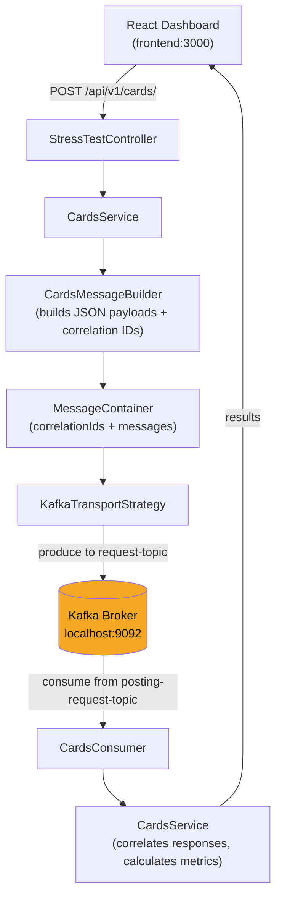

# performance


## Overview

Traditional performance-testing tools such as LoadRunner sit outside the development workflow and lack native access to your message formats and business logic. This platform replaces them with an "everything as code" approach: tests are version-controlled, domain-owned Java services that publish messages directly to Kafka and collect real end-to-end timings via correlation IDs. It is aimed at backend engineering teams running event-driven, domain-driven payment systems who want performance tests that live alongside production code and integrate naturally with CI/CD pipelines.

## Getting Started

### Prerequisites

- [Java 17](https://adoptium.net/)
- [Apache Maven 3.x](https://maven.apache.org/download.cgi)
- [Node.js 18+](https://nodejs.org/en/download)
- [Apache Kafka](https://kafka.apache.org/downloads) running on `localhost:9092`
- [Docker](https://docs.docker.com/get-docker/) _(optional — for containerised frontend)_

### Installation

Clone the repository and install both sub-projects:

```sh
$ git clone https://github.com/Harvey-Mackie/performance.git
$ cd performance

# Install server dependencies and build
$ cd server && mvn install
// BUILD SUCCESS

# Install frontend dependencies
$ cd ../frontend && npm install
// added N packages, and audited N packages in Xs
```

### Configuration

The server is configured via `server/src/main/resources/application.yml`.

| Key | Default | Description |
|---|---|---|
| `spring.kafka.bootstrap-servers` | `localhost:9092` | Kafka broker address |
| `kafka.topics.cardRequest` | `request-topic` | Topic for outbound card messages |
| `kafka.topics.cardResponse` | `posting-request-topic` | Topic for inbound card responses |
| `domains.cards.timeout` | `5` (minutes) | Max wait time for test responses |
| `domains.cards.pollInterval` | `2` (seconds) | Frequency to poll for responses |

### Usage

**Start the Spring Boot server:**

```sh
$ cd server && mvn spring-boot:run
// INFO  DemoApplication - Started DemoApplication in X.XXX seconds
```

**Trigger a Cards load test:**

```sh
$ curl -X POST http://localhost:8080/api/v1/cards/
// (empty body — check server logs for progress)
```

**Start the React frontend:**

```sh
$ cd frontend && npm run start
// Compiled successfully! Local: http://localhost:3000
```

**Build and serve the frontend via Docker:**

```sh
$ cd frontend && docker build -t performance-ui .
$ docker run -p 80:80 performance-ui
// nginx started, serving on http://localhost:80
```

## Structure

```sh
performance/
├── 📁 server/                          # Spring Boot performance service
│   ├── pom.xml                         # Maven build descriptor (Java 17, Spring Boot 3.3.0)
│   └── src/main/java/com/example/
│       ├── demo/
│       │   ├── DemoApplication.java    # Spring Boot entry point
│       │   ├── controller/
│       │   │   └── StressTestController.java  # POST /api/v1/cards/
│       │   ├── core/
│       │   │   ├── consumer/
│       │   │   │   └── BaseKafkaConsumer.java # Base Kafka consumer
│       │   │   ├── messageBuilder/
│       │   │   │   └── MessageContainer.java  # Holds correlation IDs + payloads
│       │   │   └── transport/
│       │   │       ├── TransportStrategy.java        # Transport interface
│       │   │       ├── KafkaTransportStrategy.java   # Kafka implementation
│       │   │       ├── TransportDestination.java     # Wraps topic name
│       │   │       └── TransportPayload.java         # Wraps message + correlation ID
│       │   ├── domains/
│       │   │   └── cards/
│       │   │       ├── CardsConsumer.java      # Kafka response consumer
│       │   │       ├── CardsMessageBuilder.java # Builds JSON card payloads
│       │   │       └── CardsService.java        # Orchestrates send + track + wait
│       │   └── properties/
│       │       └── ApplicationProperties.java  # Typed config properties
│       └── resources/
│           └── application.yml                 # Kafka + domain configuration
│
└── 📁 frontend/                        # React dashboard
    ├── Dockerfile                      # Multi-stage build (Node 18 → nginx:alpine)
    ├── nginx.conf                      # SPA routing config
    ├── package.json                    # Dependencies: React 18, Recharts, Bootstrap
    └── src/
        ├── index.js                    # React entry point
        └── App.js                      # Testing dashboard UI
```

## How It Works



## References

- [Spring for Apache Kafka](https://docs.spring.io/spring-kafka/docs/current/reference/html/)
- [Spring Boot Configuration Properties](https://docs.spring.io/spring-boot/docs/current/reference/html/configuration-metadata.html)
- [Recharts — React charting library](https://recharts.org/en-US/)
- [Project Lombok](https://projectlombok.org/)
